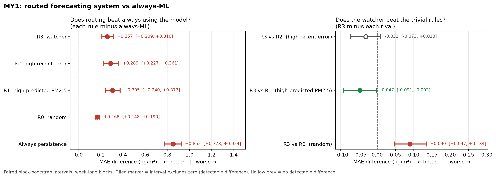

# When Should You Trust the Forecast?

I built a six-hour PM2.5 forecaster for Marylebone Road in London, then a second model (the "watcher") that tries to predict, before the real value arrives, when the forecaster is about to be unusually wrong. When the watcher distrusted a forecast, the system switched to a simple fallback. I tested whether this made the overall system more accurate.

**It did not.** Every switching rule made the system worse than always using the forecaster, and the watcher was not detectably better than the simple rule "switch when the last forecast was bad."



*Each point is a difference in mean absolute error (MAE) with a block-bootstrap confidence interval. Right of zero means worse. A hollow grey point means the interval includes zero, so there is no detectable difference.*

---

## Overview

Air quality in London is measured every hour at fixed monitoring stations. Forecasting PM2.5 a few hours ahead from recent pollution and weather is a common machine-learning task. Knowing when a forecast should not be trusted is less commonly tested. That matters to anyone making a threshold decision from the forecast, such as a school deciding whether to hold PE outdoors or a person with asthma deciding whether to go for a run.

A forecasting service still has to publish a number, so the system does not go silent when it distrusts the model. It falls back to persistence, which simply assumes the pollution level six hours from now will be the same as it is now.

There is a simple explanation that could make the whole idea trivial. Pollution episodes last for hours, so "the model was wrong recently" already predicts "the model will be wrong now." Much of the design is there to test whether the watcher adds anything beyond that.

## Research Question

> Can a system recognise, using only information available at prediction time, when its own forecast is about to be unusually wrong, and does routing those cases to a simpler fallback produce a better forecasting system overall?

## Objectives

- Build a six-hour PM2.5 forecaster and check that it beats simple baselines under a realistic evaluation.
- Build a watcher that predicts when the forecaster will have an unusually large error, using only past information.
- Compare routing on the watcher against two simple rival rules (high predicted pollution, high recent error) and a random control.
- Decide whether any difference is real using block-bootstrap confidence intervals, with the success criterion fixed before running the comparison.

## Data

| Source | What I used | Access |
|---|---|---|
| DEFRA AURN network | Hourly PM2.5 and NO₂ | DEFRA's openair `.RData` files, read with the `rdata` package |
| Open-Meteo archive (ERA5) | Hourly temperature, humidity, pressure, wind speed and direction | Free API, matched to each station's coordinates |

The data covers 2018 to 2025. 2025 is held out as a final test set (see Evaluation).

**Station selection.** I chose stations with a script rather than by hand. It kept London AURN sites with at least 80% hourly coverage for PM2.5 and NO₂ between 2018 and 2025. Four stations passed: MY1 (Marylebone Road, kerbside), KC1, BEX and HRL. CA1 was rejected at 63.8% PM2.5 coverage. The results below are for MY1 only.

**Data-quality issues I had to deal with:**

- **Timezones.** Getting this wrong would shift every hour-of-day feature by an hour for half the year without raising any error. I checked the raw timestamps across both 2020 clock changes and confirmed AURN stores genuine UTC times, so no conversion was needed. The results are in `docs/ingest_checks.md`.
- **Wind speed units.** Open-Meteo returns km/h by default. I request m/s explicitly and assert on the returned units, because a silent 3.6× scaling error would not break anything visibly.
- **Missing data.** Gaps shorter than two hours are linearly interpolated and flagged. Longer gaps are left missing, so rolling statistics are never calculated across invented values. MY1 had an instrument outage in late 2020 (November was entirely missing), which leaves one test fold with only 386 usable hours.
- **Boundary-layer height.** I dropped this variable because the Open-Meteo archive has no values for January to June 2024 at any of the stations.
- **Publication lag.** New AURN data appeared about 15 hours after measurement when I checked. This matters for any live use (see Limitations).

Data snapshot date: [TODO]

## Methodology

```
past pollution + past weather (all at or before time t)
        │
        ├──► forecasters F0–F3 ──► F3 (LightGBM) forecast for t+6h
        │
        ├──► watcher ──► "trust" or "distrust" F3 at this hour
        │
        └──► routing policy
               trust    → use F3
               distrust → use persistence (F0)
                     │
               published forecast for t+6h
                     │
               evaluation: MAE vs always using F3, with bootstrap intervals
```

The steps were:

1. Download and clean AURN and weather data, stored as Parquet.
2. Build features that only use information available at time t.
3. Fit four forecasters in a walk-forward loop and keep their out-of-fold predictions.
4. Label each hour as "unreliable" or not, based on F3's error.
5. Train the watcher on those labels, again walk-forward.
6. Apply four routing rules and compare the resulting systems.

## Models

| Model | What it does | Why it is included |
|---|---|---|
| **F0 persistence** | ŷ(t+6h) = y(t) | The bar any model has to clear. It is surprisingly hard to beat at short horizons, and it is also the fallback used for routing |
| **F1 climatology** | Average PM2.5 for that hour of day and month | A second simple baseline that ignores current conditions entirely |
| **F2 ridge regression** | Linear model on lagged pollution and weather | A weather-aware statistical reference. F3–F2 disagreement is also used as a watcher feature |
| **F3 LightGBM** | Gradient-boosted trees on 46 features | The forecaster the watcher is judging |
| **Watcher** | LightGBM classifier | Predicts whether F3's error at this hour will be unusually large |

I did not use neural networks. With one target at hourly resolution over a few years, gradient boosting is a sensible choice, and a larger model would have made the comparison harder to interpret without answering the research question any better.

## Feature Engineering

**Forecaster features:**

- PM2.5 and NO₂ at t, t−1, t−3, t−6, t−12 and t−24 hours, plus rolling means, standard deviations and rates of change.
- Temperature, humidity and pressure.
- Wind as east–west and north–south components rather than a direction in degrees. Direction is circular, so 359° and 1° are almost the same wind but look far apart as raw numbers.
- Hour of day, day of week, month and a weekend flag. These use London local time rather than UTC because traffic follows the local clock. The NO₂ rush-hour pattern was clearly sharper this way (correlation 0.925 vs 0.825).

**Watcher features (27 in four groups):**

| Group | Example | What it is meant to catch |
|---|---|---|
| Distribution distance | Wasserstein distance between recent inputs and the training period | Conditions unlike anything in the training data |
| Volatility | Rolling standard deviation of PM2.5 | Unstable periods |
| Model disagreement | \|F3 − F2\| | Cases where the two models extrapolate differently |
| Recent errors | F3's mean absolute error over the last 24 hours | The "errors come in runs" signal, which is also what the R2 rule uses |

The recent-error features only use hours whose true value was already known at time t. A forecast made at time s is only scored at s+6h, so its error cannot be used before then. The distribution distances are calculated once a day at midnight rather than every hour, to keep the computation manageable.

Any feature that depends on the training window, such as the distribution distances or the recent errors, is built inside the walk-forward loop rather than once for the whole dataset. Otherwise it would quietly use information from the test period. `docs/information_contract.md` lists what each model can see at time t.

## Evaluation

**Walk-forward validation.** This is a time-series problem, so randomly splitting hours into train and test sets would let the model learn from the future. Instead, I trained on all data before each test quarter, tested on that quarter, then moved forward and refitted. That gives 20 quarterly test folds from 2020 Q1 to 2024 Q4. Rows whose six-hour target falls in the next fold are removed at each boundary.

**Held-out year.** 2025 was kept aside and not used at any point during development, so that choices tuned on the walk-forward folds can be checked on data I have not looked at. Holdout result: [TODO]

**Leakage test.** Leaked results and honest results both produce reasonable-looking numbers with no error, so inspecting the output would not catch a leak. I used a "canary" test instead: set one input value at time t\* to an extreme value, rerun the pipeline, and check that no prediction made before t\* changed. It passed on a synthetic test case in both directions (fires on a planted leak, silent without one) and on the real pipeline at three positions.

**Defining "unreliable".** This was the most important design decision. The obvious approach is to call the 20% of hours with the largest absolute error unreliable. But absolute error grows with pollution level: an error of 15 at 55 µg/m³ is ordinary, while an error of 3 at 15 µg/m³ may not be. Ranking raw errors would mostly flag high-pollution hours, so the watcher would learn to spot pollution episodes, which is an easier problem and not the one I was asking about.

Instead, I grouped hours into ten bins by F3's *predicted* PM2.5 and labelled the top 20% of errors within each bin as unreliable. Predicted rather than actual values are used because actual values are not known at prediction time. The bin edges and cut-offs are fitted on the training data and kept fixed for the test fold, so the share of unreliable hours varies between folds (10% to 25%) rather than being forced to 20%.

**Routing rules.** Each rule sends the same share of hours (20% per fold) to persistence, so they are compared on equal terms:

| Rule | Switches to persistence when… |
|---|---|
| R0 | chosen at random (control) |
| R1 | F3's predicted PM2.5 is high |
| R2 | F3's error over the last 24 hours is high |
| R3 | the watcher's probability of an unreliable hour is high |

R1 and R2 are the key comparisons. If the watcher cannot beat them, it is only rediscovering that high pollution and recent errors predict current errors.

**Metrics:**

- **MAE** of the full routed system, compared with always using F3 and always using persistence. This is the main result because it measures the whole system at 100% coverage.
- **PR-AUC** for the watcher on its own. Unreliable hours are a minority, so accuracy would be misleading.
- **Block bootstrap** for every comparison: resample whole weeks rather than single hours, because neighbouring hours are strongly correlated. I used 219 week-long blocks, 2,000 resamples and paired comparisons. A difference only counts if its [TODO: level, e.g. 95%] interval excludes zero.

## Results

All results are for MY1.

**Forecasting** (35,799 out-of-fold hours):

| Model | MAE (µg/m³) |
|---|---|
| F0 persistence | 4.33 |
| F1 climatology | 6.12 |
| F2 ridge | 3.85 |
| **F3 LightGBM** | **3.58** |

F3 beat persistence by 17% and ridge by 7%, and beat persistence in every fold except 2020 Q1.

**Watcher:** mean PR-AUC 0.207 against a no-skill baseline of 0.186, beating the baseline in 16 of 18 scored folds. This is a small but consistent improvement over chance.

**Routing** (31,572 hours, folds 3–20; the watcher needs earlier folds to train on):

| System | MAE (µg/m³) | Difference vs always F3 [interval] |
|---|---|---|
| **Always F3** | **3.514** | — |
| R0 random | 3.682 | +0.168 [+0.148, +0.190] |
| R3 watcher | 3.772 | +0.257 [+0.209, +0.310] |
| R2 recent error | 3.803 | +0.289 [+0.227, +0.361] |
| R1 high PM2.5 | 3.819 | +0.305 [+0.240, +0.373] |
| Always persistence | 4.367 | +0.852 [+0.778, +0.924] |

**Watcher vs the other rules:**

| Comparison | MAE difference [interval] | Result |
|---|---|---|
| R3 vs R2 | −0.031 [−0.073, +0.010] | No detectable difference |
| R3 vs R1 | −0.047 [−0.091, −0.003] | R3 better, by a small margin |
| R3 vs R0 | +0.090 [+0.047, +0.134] | R3 worse than random |

**Exploratory analyses:**

- *Routing share.* Repeating the comparison for every share from 5% to 95% routed, no share beat always using F3 for any rule.
- *Risk–coverage.* The area under the risk–coverage curve (AURC, lower is better) was R1 2.703, R2 2.914, R3 3.270, R0 3.480. This measure favours R1 for the reason described under "Defining unreliable": removing high-pollution hours lowers raw error whether or not those hours were unreliable. So R1's score here says little about detecting unreliability.
- *Relative-error labels.* I repeated the analysis with "unreliable" defined as a large error relative to the prediction, |y − ŷ| / max(ŷ, floor), with the floor at the 10th percentile of predicted PM2.5. The labels matched the main labels on 90.6% of hours. Watcher PR-AUC was 0.198 against 0.183, and R3's routed MAE was 3.718, still worse than always F3 and random. Under these labels R3 did beat R2 (−0.085 [−0.158, −0.023]). I do not treat this as a finding, because the main comparison shows no difference and this check is exploratory.

## Key Findings

- LightGBM beat all three baselines, so the forecaster was a reasonable model to judge.
- The watcher picked out F3's bad hours slightly better than chance.
- Routing those hours to persistence made the system worse, and so did every other rule. Random routing was the least harmful.
- The watcher was not detectably better than switching after a bad recent forecast. At this station, the extra features added nothing detectable beyond "errors come in runs."
- The failure has a clear cause. The hours the watcher flags are volatile, and persistence, which assumes nothing changes, is even worse than F3 in exactly those hours. Better routing is possible in principle: switching with perfect knowledge of which model would win reaches an MAE of 2.866 with 40% of hours routed. The watcher could spot trouble, but persistence was not a better place to send it.

## Limitations

- **One station.** All routing results are for MY1, which is also the only kerbside site that passed the coverage check. The results may differ at background or suburban sites.
- **One fallback and one routing share.** The negative result is for switching to persistence at 20%. It does not show that this kind of watcher could never be useful.
- **Backtest only.** With a publication lag of about 15 hours, a live system would have less recent-error information than this backtest assumed, so the R2 and R3 rules would likely perform worse in practice.
- **Feature importance.** Among the watcher's features, the distribution-distance group was used most. LightGBM's split-count importance favours features with many distinct values, and I have not yet run an ablation, so I do not draw conclusions about which feature group matters.
- **Implementation shortcuts.** The target column ended up in the feature table. It is excluded explicitly, with assertions in `src/forecast.py`, rather than by rebuilding the features. Distribution distances are updated daily rather than hourly.
- **No causal claims.** The results show what predicts F3's errors, not what causes them.
- **No new method.** Selective prediction and model routing are established ideas. What this project adds is a careful comparison on real data, with baselines, leakage checks and confidence intervals.

## Future Work

- **Train the watcher on the question routing actually asks.** The watcher predicts "will F3 be bad?", but switching only helps when "will persistence be better than F3?" These turned out to be different questions.
- **Try ridge (F2) as the fallback.** It beat persistence in every fold and may cope better with volatile hours.
- **Run the other three stations**, including leave-one-station-out tests of whether a watcher trained elsewhere transfers to a new site.
- **Ablation study:** remove each watcher feature group in turn and measure the effect.
- **Measure the "optimism gap":** how much better the forecasts look if observed future weather is allowed, which is not possible in real use.
- **Live scoreboard:** log the watcher's calls in real time and score them afterwards. The AURN lag means this would have to be a retrospective scoreboard rather than live routing.

## Project Structure

```
when-should-you-trust-the-forecast/
├── README.md
├── PROJECT_SPEC.md              # plan, hypotheses and dated changes
├── docs/
│   ├── ingest_checks.md         # timezone and data-freshness checks
│   ├── information_contract.md  # what each model may use at time t
│   ├── harness_design.md        # walk-forward design
│   ├── domain_notes.md          # background on air-quality forecasting
│   └── session_log.md
├── src/
│   ├── ingest.py                # AURN + Open-Meteo → Parquet
│   ├── select_stations.py       # coverage-based station selection
│   ├── features.py              # features that do not depend on the fold
│   ├── eda.py
│   ├── evaluate.py              # walk-forward harness and canary test
│   ├── forecast.py              # F0–F3
│   ├── run_forecast.py
│   ├── labels.py                # stratified "unreliable" labels
│   ├── watcher_features.py
│   ├── watcher.py
│   ├── routing.py               # R0–R3
│   ├── risk_coverage.py
│   ├── robustness_rel.py        # relative-error label check
│   ├── bootstrap.py
│   └── plot_headline.py
├── tests/
│   ├── test_canary.py
│   └── test_canary_pipeline.py
├── notebooks/01_exploration.ipynb
├── sql/schema.sql
└── results/
    ├── *.csv
    └── figures/
```

[TODO: check this against the repo and add any files not listed, e.g. environment.yml]

## Technologies

- Python 3.12, conda
- pandas, LightGBM, matplotlib
- `rdata` for reading DEFRA's `.RData` files
- Parquet for storage
- [TODO: add remaining packages from environment.yml]

## Reproducing the Project

```
conda activate aq
python -m src.ingest
python -m src.select_stations
python -m src.features
python -m src.run_forecast
python -m src.watcher
python -m src.routing
python -m src.risk_coverage
python -m src.bootstrap
python -m src.plot_headline
```

[TODO: add environment setup, confirm the order and arguments of each command, and include the `--relative` runs for the robustness check]

## Author

[TODO: your name]. Final-year BSc Mathematics and Data Science student at City St George's, University of London.

GitHub: [abdullahiali1545-arch](https://github.com/abdullahiali1545-arch)
