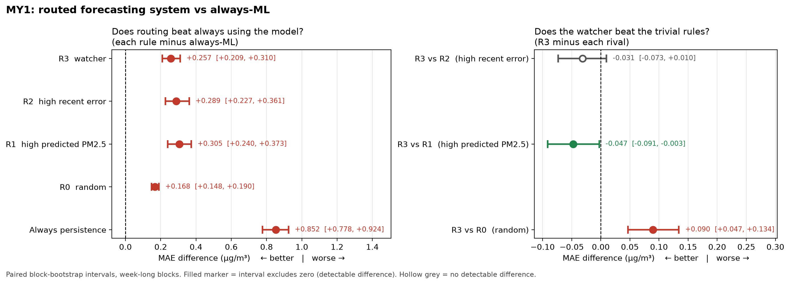

# When Should You Trust the Forecast?

I built a six-hour PM2.5 forecaster for London, starting with Marylebone Road, then a second model (the "watcher") that tries to predict, before the real value arrives, when the forecaster is about to be unusually wrong. When the watcher distrusted a forecast, the system switched to a simple fallback. I tested whether this made the overall system more accurate, at four monitoring stations and on a held-out year.

**It did not.** Switching distrusted forecasts to the fallback made the forecast worse at all four stations I tested. The watcher did less harm than simple switching rules at three of the four, but it never beat always using the model, or even switching at random.



*Main station (MY1, Marylebone Road). Each point is a difference in mean absolute error (MAE) with a 95% block-bootstrap confidence interval. Right of zero means worse. A hollow grey point means the interval includes zero, so there is no detectable difference.*

---

## Overview

Air quality in London is measured every hour at fixed monitoring stations. Forecasting PM2.5 a few hours ahead from recent pollution and weather is a common machine-learning task. Knowing when a forecast should not be trusted is less commonly tested. That matters to anyone making a threshold decision from the forecast, such as a school deciding whether to hold PE outdoors or a person with asthma deciding whether to go for a run.

A forecasting service still has to publish a number, so the system does not go silent when it distrusts the model. It falls back to persistence, which simply assumes the pollution level six hours from now will be the same as it is now.

There is a simple explanation that could make the whole idea trivial. Pollution episodes last for hours, so "the model was wrong recently" already predicts "the model will be wrong now." Much of the design is there to test whether the watcher adds anything beyond that.

## Research Question

> Can a system recognise, using only information available at prediction time, when its own forecast is about to be unusually wrong, and does routing those cases to a simpler fallback produce a better forecasting system overall?

## Objectives

- Build a six-hour PM2.5 forecaster and check that it beats simple baselines under a realistic evaluation.
- Build a watcher that predicts when the forecaster will have an unusually large error, using only past information.
- Compare routing on the watcher against two simple rival rules (high predicted pollution, high recent error) and a random control.
- Decide whether any difference is real using block-bootstrap confidence intervals, with the success criterion fixed before running the comparison.
- Check whether the result holds on a held-out year and at other stations.

## Data

| Source | What I used | Access |
|---|---|---|
| DEFRA AURN network | Hourly PM2.5 and NO₂ | DEFRA's openair `.RData` files, read with the `rdata` package |
| Open-Meteo archive (ERA5) | Hourly temperature, humidity, pressure, wind speed and direction | Free API, matched to each station's coordinates |

The data covers 2018 to 2025. 2025 is held out as a final test set (see Evaluation).

**Station selection.** I chose stations with a script rather than by hand. It kept London AURN sites with at least 80% hourly coverage for PM2.5 and NO₂ between 2018 and 2025. Four stations passed: MY1 (Marylebone Road, kerbside), KC1, BEX and HRL. CA1 was rejected at 63.8% PM2.5 coverage. The main results are for MY1. I then ran the same pipeline, unchanged, at the other three stations (see Results).

**Data-quality issues I had to deal with:**

- **Timezones.** Getting this wrong would shift every hour-of-day feature by an hour for half the year without raising any error. I checked the raw timestamps across both 2020 clock changes and confirmed AURN stores genuine UTC times, so no conversion was needed. The results are in `docs/ingest_checks.md`.
- **Wind speed units.** Open-Meteo returns km/h by default. I request m/s explicitly and assert on the returned units, because a silent 3.6× scaling error would not break anything visibly.
- **Missing data.** Gaps shorter than two hours are linearly interpolated and flagged. Longer gaps are left missing, so rolling statistics are never calculated across invented values. MY1 had an instrument outage in late 2020 (November was entirely missing), which leaves one test fold with only 386 usable hours.
- **Boundary-layer height.** I dropped this variable because the Open-Meteo archive has no values for January to June 2024 at any of the stations.
- **Publication lag.** New AURN data appeared about 15 hours after measurement when I checked. This matters for any live use (see Limitations).

Data snapshot dates: MY1 pulled 2026-08-29; KC1, BEX and HRL pulled 2026-09-04 (recorded in `docs/ingest_checks.md` and `docs/session_log.md`). None has been re-pulled since, so every backtest result uses these snapshots.

## Methodology

```
past pollution + past weather (all at or before time t)
        │
        ├──► forecasters F0–F3 ──► F3 (LightGBM) forecast for t+6h
        │
        ├──► watcher ──► "trust" or "distrust" F3 at this hour
        │
        └──► routing policy
               trust    → use F3
               distrust → use persistence (F0)
                     │
               published forecast for t+6h
                     │
               evaluation: MAE vs always using F3, with bootstrap intervals
```

The steps were:

1. Download and clean AURN and weather data, stored as Parquet.
2. Build features that only use information available at time t.
3. Fit four forecasters in a walk-forward loop and keep their out-of-fold predictions.
4. Label each hour as "unreliable" or not, based on F3's error.
5. Train the watcher on those labels, again walk-forward.
6. Apply four routing rules and compare the resulting systems.

## Models

| Model | What it does | Why it is included |
|---|---|---|
| **F0 persistence** | ŷ(t+6h) = y(t) | The bar any model has to clear. It is surprisingly hard to beat at short horizons, and it is also the fallback used for routing |
| **F1 climatology** | Average PM2.5 for that hour of day and month | A second simple baseline that ignores current conditions entirely |
| **F2 ridge regression** | Linear model on lagged pollution and weather | A weather-aware statistical reference. F3–F2 disagreement is also used as a watcher feature |
| **F3 LightGBM** | Gradient-boosted trees on 46 features | The forecaster the watcher is judging |
| **Watcher** | LightGBM classifier | Predicts whether F3's error at this hour will be unusually large |

I did not use neural networks. With one target at hourly resolution over a few years, gradient boosting is a sensible choice, and a larger model would have made the comparison harder to interpret without answering the research question any better.

## Feature Engineering

**Forecaster features:**

- PM2.5 and NO₂ at t, t−1, t−3, t−6, t−12 and t−24 hours, plus rolling means, standard deviations and rates of change.
- Temperature, humidity and pressure.
- Wind as east–west and north–south components rather than a direction in degrees. Direction is circular, so 359° and 1° are almost the same wind but look far apart as raw numbers.
- Hour of day, day of week, month and a weekend flag. These use London local time rather than UTC because traffic follows the local clock. The NO₂ rush-hour pattern was clearly sharper this way (correlation 0.925 vs 0.825).

**Watcher features (27 in four groups):**

| Group | Example | What it is meant to catch |
|---|---|---|
| Distribution distance | Wasserstein distance between recent inputs and the training period | Conditions unlike anything in the training data |
| Volatility | Rolling standard deviation of PM2.5 | Unstable periods |
| Model disagreement | \|F3 − F2\| | Cases where the two models extrapolate differently |
| Recent errors | F3's mean absolute error over the last 24 hours | The "errors come in runs" signal, which is also what the R2 rule uses |

The recent-error features only use hours whose true value was already known at time t. A forecast made at time s is only scored at s+6h, so its error cannot be used before then. The distribution distances are calculated once a day at midnight rather than every hour, to keep the computation manageable.

Any feature that depends on the training window, such as the distribution distances or the recent errors, is built inside the walk-forward loop rather than once for the whole dataset. Otherwise it would quietly use information from the test period. `docs/information_contract.md` lists what each model can see at time t.

## Evaluation

**Walk-forward validation.** This is a time-series problem, so randomly splitting hours into train and test sets would let the model learn from the future. Instead, I trained on all data before each test quarter, tested on that quarter, then moved forward and refitted. That gives 20 quarterly test folds from 2020 Q1 to 2024 Q4. Rows whose six-hour target falls in the next fold are removed at each boundary.

**Held-out year.** 2025 was kept aside and not used at any point during development, so that choices tuned on the walk-forward folds could be checked on data I had not looked at. I ran it once, at MY1, after the main results were final, by extending the same pipeline to four more quarterly folds. Before any 2025 number was read, I checked that the first 20 folds reproduced the committed results exactly at every stage. The holdout agreed with the main result (see Results).

**Leakage test.** Leaked results and honest results both produce reasonable-looking numbers with no error, so inspecting the output would not catch a leak. I used a "canary" test instead: set one input value at time t\* to an extreme value, rerun the pipeline, and check that no prediction made before t\* changed. It passed on a synthetic test case in both directions (fires on a planted leak, silent without one) and on the real pipeline at three positions.

**Defining "unreliable".** This was the most important design decision. The obvious approach is to call the 20% of hours with the largest absolute error unreliable. But absolute error grows with pollution level: an error of 15 at 55 µg/m³ is ordinary, while an error of 3 at 15 µg/m³ may not be. Ranking raw errors would mostly flag high-pollution hours, so the watcher would learn to spot pollution episodes, which is an easier problem and not the one I was asking about.

Instead, I grouped hours into ten bins by F3's *predicted* PM2.5 and labelled the top 20% of errors within each bin as unreliable. Predicted rather than actual values are used because actual values are not known at prediction time. The bin edges and cut-offs are fitted on the training data and kept fixed for the test fold, so the share of unreliable hours varies between folds (10% to 25%) rather than being forced to 20%.

**Routing rules.** Each rule sends the same share of hours (20% per fold) to persistence, so they are compared on equal terms:

| Rule | Switches to persistence when… |
|---|---|
| R0 | chosen at random (control) |
| R1 | F3's predicted PM2.5 is high |
| R2 | F3's error over the last 24 hours is high |
| R3 | the watcher's probability of an unreliable hour is high |

R1 and R2 are the key comparisons. If the watcher cannot beat them, it is only rediscovering that high pollution and recent errors predict current errors.

**Metrics:**

- **MAE** of the full routed system, compared with always using F3 and always using persistence. This is the main result because it measures the whole system at 100% coverage.
- **PR-AUC** for the watcher on its own. Unreliable hours are a minority, so accuracy would be misleading.
- **Block bootstrap** for every comparison: resample whole weeks rather than single hours, because neighbouring hours are strongly correlated. I used week-long blocks (219 at MY1), 2,000 resamples and paired comparisons. A difference only counts if its 95% interval excludes zero.

## Results

The main results are for MY1. The holdout and other-station results follow.

**Forecasting** (35,799 out-of-fold hours):

| Model | MAE (µg/m³) |
|---|---|
| F0 persistence | 4.33 |
| F1 climatology | 6.12 |
| F2 ridge | 3.85 |
| **F3 LightGBM** | **3.58** |

F3 beat persistence by 17% and ridge by 7%, and beat persistence in every fold except 2020 Q1.

**Watcher:** mean PR-AUC 0.207 against a no-skill baseline of 0.186, beating the baseline in 16 of 18 scored folds. This is a small but consistent improvement over chance.

**Routing** (31,572 hours, folds 3–20; the watcher needs earlier folds to train on):

| System | MAE (µg/m³) | Difference vs always F3 [interval] |
|---|---|---|
| **Always F3** | **3.514** | — |
| R0 random | 3.682 | +0.168 [+0.148, +0.190] |
| R3 watcher | 3.772 | +0.257 [+0.209, +0.310] |
| R2 recent error | 3.803 | +0.289 [+0.227, +0.361] |
| R1 high PM2.5 | 3.819 | +0.305 [+0.240, +0.373] |
| Always persistence | 4.367 | +0.852 [+0.778, +0.924] |

**Watcher vs the other rules:**

| Comparison | MAE difference [interval] | Result |
|---|---|---|
| R3 vs R2 | −0.031 [−0.073, +0.010] | No detectable difference |
| R3 vs R1 | −0.047 [−0.091, −0.003] | R3 better by a small margin; not repeated on the 2025 holdout |
| R3 vs R0 | +0.090 [+0.047, +0.134] | R3 worse than random |

### 2025 holdout (MY1, run once)

8,058 hours, 53 week-long blocks.

| Comparison | Walk-forward 2020–2024 | Holdout 2025 |
|---|---|---|
| R3 vs always F3 | +0.257 [+0.209, +0.310] | +0.283 [+0.153, +0.409] |
| R3 vs R2 | −0.031 [−0.073, +0.010] | +0.026 [−0.042, +0.097] |
| R3 vs R1 | −0.047 [−0.091, −0.003] | −0.004 [−0.074, +0.065] |
| R3 vs R0 | +0.090 [+0.047, +0.134] | +0.076 [−0.032, +0.188] |
| Watcher PR-AUC vs baseline | 0.207 vs 0.186 (1.12×) | 0.225 vs 0.207 (1.08×) |

The holdout agreed with the main result. Every routing rule was again detectably worse than always using F3, and the watcher was again not detectably better than R2. The small R3-over-R1 advantage from the walk-forward folds did not appear in 2025, so I do not treat it as a finding. With 53 weeks rather than 219, the intervals are wider, so the R3 vs R0 difference no longer excludes zero even though the estimate barely changed.

### Other stations

I ran the identical pipeline at KC1, BEX and HRL, with each station's models trained on its own data and no settings changed. These are walk-forward results; 2025 was not used.

| Station | Always F3 MAE | R3 vs always F3 | R3 vs R2 | R3 vs R1 | R3 vs R0 | Watcher lift |
|---|---|---|---|---|---|---|
| MY1 | 3.514 | +0.257 [+0.209, +0.310] | −0.031 [−0.073, +0.010] | −0.047 [−0.091, −0.003] | +0.090 [+0.047, +0.134] | 1.12× |
| KC1 | 2.669 | +0.192 [+0.146, +0.244] | −0.053 [−0.088, −0.018] | −0.050 [−0.085, −0.016] | +0.081 [+0.043, +0.122] | 1.14× |
| BEX | 3.084 | +0.199 [+0.156, +0.249] | −0.102 [−0.161, −0.050] | −0.112 [−0.165, −0.062] | +0.080 [+0.040, +0.123] | 1.16× |
| HRL | 2.515 | +0.162 [+0.124, +0.207] | −0.061 [−0.095, −0.028] | −0.053 [−0.084, −0.024] | +0.063 [+0.031, +0.098] | 1.12× |

F3 beat persistence by about 16% at each of the three new stations.

At every station, every routing rule was detectably worse than always using F3. At KC1, BEX and HRL the watcher was detectably better than R1 and R2, but at every station it was also detectably worse than random routing. The ranking was the same at all three new stations: always F3, then random, then the watcher, then R1 and R2.

So "the watcher beat R2" here means it did less harm than R2, not that it helped. I had not decided in advance how to interpret a split like this (a difference at three stations but not the fourth), so I treat it cautiously. The stations also share almost the same city-wide weather inputs, so they are not three independent confirmations.

### Exploratory analyses

- *Why the watcher does less harm.* At KC1, BEX and HRL, the share of routed hours where persistence actually beat F3 was about the same for every rule (40–42%). What differed was the size of the loss in the other hours: smaller for the watcher than for R1 and R2, and smallest for random routing. This suggests the watcher's advantage comes from avoiding the most extreme hours rather than from finding hours where the fallback wins.
- *Routing share (MY1).* Repeating the comparison for every share from 5% to 95% routed, no share beat always using F3 for any rule.
- *Risk–coverage (MY1).* The area under the risk–coverage curve (AURC, lower is better) was R1 2.703, R2 2.914, R3 3.270, R0 3.480. This measure favours R1 for the reason described under "Defining unreliable": removing high-pollution hours lowers raw error whether or not those hours were unreliable. So R1's score here says little about detecting unreliability.
- *Relative-error labels (MY1).* I repeated the analysis with "unreliable" defined as a large error relative to the prediction, |y − ŷ| / max(ŷ, floor), with the floor at the 10th percentile of predicted PM2.5. The labels matched the main labels on 90.6% of hours. Watcher PR-AUC was 0.198 against 0.183, and R3's routed MAE was 3.718, still worse than always F3 and random. Under these labels R3 did beat R2 (−0.085 [−0.158, −0.023]). I do not treat this as a finding, because the main comparison shows no difference and this check is exploratory.

## Live prospective log

A backtest can be re-run until it looks good. A log written before the answers exist cannot. So the last part of the project runs the forecaster live and records each forecast before DEFRA publishes the reading it predicts. The design, thresholds and claim rules were all committed to `PROJECT_SPEC.md` before the first live forecast (changelog entries dated 2026-09-29).

**[Live map](https://abdullahiali1545-arch.github.io/when-should-you-trust-the-forecast/)** · [raw log](https://github.com/abdullahiali1545-arch/when-should-you-trust-the-forecast/tree/live-log/data/live)

**A warning, not switching.** Every switching rule lost to always using F3, so the live system always publishes F3 and shows a warning when recent forecasts have been poor. A warning only needs F3 to be worse than usual in flagged hours. It does not need persistence to be better.

**Which warning.** I compared F3's error in flagged hours with its error in unflagged hours, for each rule, with week-block bootstrap intervals. On raw error, the simple rules looked best (R1 2.01–2.71× worse in flagged hours, R2 1.70–2.16×, R3 1.32–1.53×). Raw error rewards any rule that picks high-pollution hours, for the reason under "Defining unreliable", so the rule for choosing was fixed before running a level-adjusted comparison, where each hour's error is divided by the average error for its predicted-concentration decile:

| Station | R1: pollution high | R2: recent error high | R3: watcher | R3 vs R2 |
|---|---|---|---|---|
| MY1 | 1.00 | 1.11 | 1.07 | no detectable difference |
| KC1 | 1.00 | 1.15 | 1.09 | no detectable difference |
| BEX | 1.00 | 1.15 | 1.11 | no detectable difference |
| HRL | 1.00 | 1.17 | 1.12 | no detectable difference |

R1 carries nothing beyond the pollution level itself. The watcher beat R1 and random at every station but was not detectably different from R2, so under the pre-registered rule the map uses R2: flag a site when F3's average error over the previous day is at or above a fixed threshold (the 80th percentile in the walk-forward folds: MY1 4.57, KC1 3.64, BEX 4.28, HRL 3.43 µg/m³). With a threshold fixed in advance, as a live system requires, the warning still held (level-adjusted 1.11–1.17) and flagged about 17% of hours, far more in January to March than in autumn.

**The model is frozen, and verifiably the same model.** One F3 per station, trained once on data to the end of 2025. Before freezing, the training recipe was checked by refitting fold 20 and reproducing the committed out-of-fold forecasts exactly. The live forecasts are also identical on Windows and Linux: 24 of 24 matched to every decimal place in the first comparison.

**What the publication delay means.** AURN publishes in a daily batch, about 8–15 hours behind. The logger forecasts only from origins whose target reading has not been published yet, which gives about six forecasts per station per day, all from the last hours of the batch (evening origins). At those origins the model knows exactly what the backtest knew, so the delay limits which hours can be forecast rather than how much the warning knows. The warning's inputs are F3 forecasts at every recent hour, recomputed by the frozen model from published data; they are never scored.

**Integrity.** A scheduled GitHub Actions job writes forecasts and scores to separate append-only files on a `live-log` branch that blocks force-pushes and deletion. Each commit records the code version that produced it. GitHub's scheduler is best-effort, so runs are sometimes hours apart; this loses no forecasts, because each batch's origins stay unpublished until the next batch.

**What I can and cannot claim.** I can say every forecast was logged before its reading was published. I cannot call it real-time while the data are hours late, and I will not make comparative claims until at least 26 weeks of scored forecasts, including a full January to March, exist.

## Key Findings

- LightGBM beat all three baselines at every station, so the forecaster was a reasonable model to judge.
- The watcher picked out F3's bad hours slightly better than chance at every station (lift 1.12–1.16×).
- Routing those hours to persistence made the system worse at all four stations and on the 2025 holdout. So did every other rule. Random routing was the least harmful everywhere.
- At MY1 the watcher was not detectably better than switching after a bad recent forecast, in either the walk-forward folds or the holdout. At the other three stations it was detectably better than the simple rules, but still worse than random, so it did less harm rather than any good.
- The failure has a clear cause. The hours any rule flags tend to be volatile, and persistence, which assumes nothing changes, is even worse than F3 in exactly those hours. Better routing is possible in principle: at MY1, switching with perfect knowledge of which model would win reaches an MAE of 2.866 with 40% of hours routed. The watcher could spot trouble, but persistence was not a better place to send it.

## Limitations

- **Four stations in one city.** The stations share almost the same weather inputs, so they are not independent tests. MY1 is the only kerbside site, so I cannot separate a station effect from a site-type effect.
- **Holdout at one station.** The 2025 holdout was run at MY1 only.
- **One fallback and one routing share.** The negative result is for switching to persistence at 20%. It does not show that this kind of watcher could never be useful.
- **Live evidence is still accumulating.** All results above are backtests. The live log started on 30 September 2026 and is descriptive until the pre-registered minimum run. I originally expected the publication lag to leave a live warning with less recent-error information than the backtest. That was wrong: live forecasts are made from the newest published hour, where the model knows exactly what the backtest knew. The lag instead restricts which hours can be forecast live.
- **Live threshold drift.** The warning threshold was fitted on walk-forward errors, while the live model was trained on more data, so the live flag rate may fall below 20%. It is reported, not corrected.
- **Feature importance.** Among the watcher's features, the distribution-distance group was used most at every station. LightGBM's split-count importance favours features with many distinct values, and I have not run an ablation, so I do not draw conclusions about which feature group matters.
- **Implementation shortcuts.** The target column ended up in the feature table. It is excluded explicitly, with assertions in `src/forecast.py`, rather than by rebuilding the features. Distribution distances are updated daily rather than hourly.
- **No causal claims.** The results show what predicts F3's errors, not what causes them.
- **No new method.** Selective prediction and model routing are established ideas. What this project adds is a careful comparison on real data, with baselines, leakage checks and confidence intervals.

## Future Work

- **Train the watcher on the question routing actually asks.** The watcher predicts "will F3 be bad?", but switching only helps when "will persistence be better than F3?" The results across all four stations suggest these are different questions.
- **Try ridge (F2) as the fallback.** It beat persistence in every fold and may cope better with volatile hours.
- **Leave-one-station-out tests** of whether a watcher trained at some stations transfers to a new one.
- **Stations outside London**, with genuinely different weather, to get more independent replications.
- **Ablation study:** remove each watcher feature group in turn and measure the effect.
- **Measure the "optimism gap":** how much better the forecasts look if observed future weather is allowed, which is not possible in real use.

## Project Structure

```
when-should-you-trust-the-forecast/
├── README.md
├── PROJECT_SPEC.md              # plan, hypotheses and dated, pre-registered changes
├── environment.yml              # full conda environment (Windows)
├── requirements.txt             # pip packages
├── requirements-live.txt        # pinned packages for the live logger
├── smoke_test.py                # first check that both data sources return data
├── .github/workflows/live.yml   # scheduled live logger
├── docs/
│   ├── ingest_checks.md         # timezone, freshness and ingest checks
│   ├── information_contract.md  # what each model may use at time t
│   ├── harness_design.md        # walk-forward design
│   ├── station_selection.md     # coverage audit, including rejected stations
│   ├── domain_notes.md          # background on air-quality forecasting
│   ├── session_log.md
│   └── index.html               # live map (GitHub Pages)
├── src/
│   ├── ingest.py                # AURN + Open-Meteo → Parquet
│   ├── tz_check.py              # timezone verification
│   ├── freshness_check.py       # publication lag at MY1
│   ├── select_stations.py       # coverage-based station selection
│   ├── features.py              # features that do not depend on the fold
│   ├── eda.py                   # exploratory figures
│   ├── evaluate.py              # walk-forward harness and canary test
│   ├── forecast.py              # F0–F3
│   ├── run_w2_5.py              # first baseline scores (F0, F1)
│   ├── run_forecast.py          # scores F0–F3 through the harness
│   ├── labels.py                # stratified "unreliable" labels
│   ├── watcher_features.py
│   ├── watcher.py
│   ├── routing.py               # R0–R3
│   ├── risk_coverage.py
│   ├── robustness_rel.py        # relative-error label check
│   ├── bootstrap.py
│   ├── plot_headline.py
│   ├── check_warning.py         # live warning choice: R0–R3 flagged vs unflagged error
│   ├── live_threshold.py        # fixed R2 threshold, evening-origin check
│   ├── freshness.py             # how late each data source is
│   ├── freeze.py                # verify the F3 recipe, then freeze to 2025-12-31
│   └── live.py                  # the live logger
├── models/                      # frozen F3 per station + manifests
├── tests/
│   ├── test_canary.py
│   └── test_canary_pipeline.py
├── notebooks/01_exploration.ipynb
├── sql/schema.sql
└── results/
    ├── *.csv
    └── figures/
```

Data files (`data/`) are not committed; the reproduce commands below rebuild them.

## Technologies

- Python 3.12, conda
- pandas, LightGBM, scikit-learn, matplotlib
- `rdata` for reading DEFRA's `.RData` files
- Parquet for storage
- GitHub Actions and GitHub Pages for the live log and map, Leaflet for the map
- NumPy, and SciPy for the distribution-distance (Wasserstein) features
- pytest for the canary tests
- Exact versions are pinned in `environment.yml` and `requirements.txt`

## Reproducing the Project

Setup, once. `environment.yml` pins the exact versions used; it was built on Windows, so a few Windows-only packages in it will not install elsewhere (the live logger on Linux uses `requirements-live.txt` instead).

```
conda env create -f environment.yml
conda activate aq
```

Main station (MY1), run from the repo root in this order:

```
python -m src.select_stations                           # optional: re-runs the station coverage audit (reads raw data only)
python -m src.ingest --site MY1 --start 2018 --end 2025  # AURN + weather -> data/processed/MY1.parquet
python -m src.features --station MY1                     # -> data/features/MY1.parquet
python -m src.run_forecast
python -m src.watcher
python -m src.routing
python -m src.risk_coverage
python -m src.bootstrap
python -m src.plot_headline
```

Other stations: ingest and build features first, then the four pipeline scripts take `--station`:

```
python -m src.ingest --site KC1 --start 2018 --end 2025
python -m src.features --station KC1
python -m src.run_forecast --station KC1
python -m src.watcher --station KC1
python -m src.routing --station KC1
python -m src.bootstrap --station KC1
```

2025 holdout (MY1 only; the design is that this is run once):

```
python -m src.run_forecast --holdout
python -m src.watcher --holdout
python -m src.routing --holdout
python -m src.bootstrap --holdout
```

Live system (the scheduled job runs `src.live` on GitHub; locally, only ever write to a test folder):

```
python -m src.freeze --station MY1
python -m src.live --live-dir data/live_test
```

Relative-error robustness check (MY1 only; run after the main MY1 pipeline, since it reuses its forecasts):

```
python -m src.robustness_rel
python -m src.routing --relative
python -m src.risk_coverage --relative
python -m src.bootstrap --relative
python -m src.plot_headline --relative
```

## Author

Abdulahi Ali. Final-year BSc Mathematics and Data Science student at City St George's, University of London.

GitHub: [abdullahiali1545-arch](https://github.com/abdullahiali1545-arch)